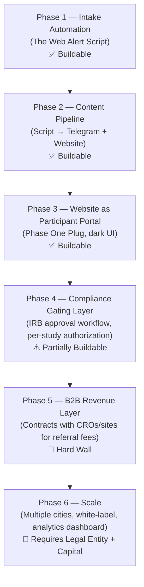

# Phase One Plug — Architecture Map & Solo Build Analysis

---

## How the Web Alert Script Connects to the Website

Short answer: **Yes, it should.** Right now, the pipeline is broken into disconnected steps. Here is what exists vs. what was planned:

```
[Web Alert App]
      ↓  (manual copy/paste)
[Sears cleans up formatting by hand]
      ↓  (manual copy/paste)
[Sears posts to Telegram manually]
      ↓  (manual, no connection)
[Phase One Plug Website — static display]
```

What the Web Alert script was supposed to do:

```
[Web Alert App]
      ↓  (auto-triggered)
[Formatting Script — strips asterisks, spaces, periods]
      ↓  (auto-parsed)
[Structured Record: Study Name / Location / Compensation / CTA]
      ↓  (two outputs simultaneously)
  [Telegram Post]     [Website Listing Page]
```

So yes — the script is the **central nervous system** of the whole content pipeline. Without it, the website is a static brochure and Telegram is a manual job. With it, the website and Telegram channel both get populated from a single automated intake. That is the core value proposition.

---

## The Full Build Map (1-Person Vibe-Coded Project)



---

## Phase-by-Phase Breakdown

### ✅ Phase 1 — Intake Automation (The Web Alert Script)
**What it is:** A script that receives the raw messy text from the Web Alert app, strips bad formatting (spaces, asterisks, periods), and structures the data into clean fields (Study Name, Condition, Location, Compensation, CTA link, Contact number).

**How hard is it?** This is genuinely buildable in a few hours in Python. It is a regex/string-cleaning script with a structured output (JSON or a formatted template). The hardest part is handling edge cases in the input format.

**How it connects:** The script outputs a clean record that feeds BOTH Telegram and the website simultaneously, instead of Sears doing two manual jobs.

**Solo viability:** ✅ High. This is a real, completable deliverable.

---

### ✅ Phase 2 — Content Pipeline (Script → Telegram + Website)
**What it is:** Wiring the formatting script to the Telegram Bot API (to auto-post to the Telegram channel) and to a simple CMS or database that powers the website's listing page.

**How hard is it?** Moderate. The Telegram Bot API is well-documented and straightforward. The website database connection depends on the stack (a simple Airtable or Supabase backend would work fine).

**Solo viability:** ✅ Achievable with no-code/low-code tools (Make.com + Airtable + Telegram Bot API).

---

### ✅ Phase 3 — Website as Participant Portal (Phase One Plug)
**What it is:** The dark-themed (blues/purples/black) website displaying current study listings, a search/filter by location and condition type, and a CTA to contact the study team.

**How hard is it?** The UI prototype was already built. Connecting it to a live database of formatted listings is the next step.

**Solo viability:** ✅ Achievable. A no-code tool (Webflow, Framer) or a lightweight static site with a Supabase backend can handle this.

---

### ⚠️ Phase 4 — Compliance Gating Layer (The First Real Wall)
**What it is:** Every study listing requires written IRB authorization before it can be published. This means building a workflow that:
1. Flags a new study record as "Pending Authorization"
2. Drafts and sends an approval-request email to the research site
3. Tracks the response (approved / denied / expired)
4. Only allows a study to go live on the website and Telegram after a human approves it

**How hard is it to build the tooling?** Moderate — this is an approval-gated pipeline. Buildable in Make.com + Airtable with an approval email and a checkbox field.

**Where it gets hard:** It is not the software that is the problem here. It is the **human labor and relationship-building** involved in actually getting dozens of research sites to respond to approval-request emails from an unknown operator. Most sites will not respond. Many will escalate to their IRB coordinator. This process cannot be automated — it requires persistent human follow-up.

**Solo viability:** ⚠️ The tooling is buildable. The process of getting approvals is a sustained, non-automatable relationship-development job.

---

### 🚫 Phase 5 — B2B Revenue Layer (The Hard Wall)
**What it is:** Negotiating written contracts with CROs, research sites, or recruitment vendors (like Antidote or Reify Health) to earn referral fees, per-consented-referral fees, or monthly retainer revenue.

**Why this is a hard wall for a solo vibe-coded project:**

| Problem | Why It Can't Be Vibe-Coded |
|---|---|
| **Legal contracts** | CROs and sponsors require formal MSAs, Business Associate Agreements (BAAs), and referral fee agreements before writing a check. These require a lawyer to review. |
| **Credibility gap** | A solo operator with a Telegram channel and a website will not get taken seriously by mid-size CROs. They need to see volume, compliance documentation, and a track record. |
| **Referral fee regulations** | In some states, paying referral fees for clinical trial recruitment is legally grey or restricted. Requires legal counsel to navigate by geography. |
| **HIPAA exposure** | The moment you touch a participant's health information (even a checkbox for a condition), you become a potential Business Associate under HIPAA. |

**Solo viability:** 🚫 This cannot be solved with code. It requires a legal entity, a lawyer, capital, and a meaningful track record of volume.

---

### 🚫 Phase 6 — Scale
Multi-city rollout, white-label services to recruitment vendors, analytics dashboard, SMS outreach to the participant community.

**Solo viability:** 🚫 Requires capital, a team, and a working B2B revenue model first. There is no path here without Phase 5 working.

---

## Where You Would Have Hit the Wall as a 1-Person Builder

| Phase | What Stops You |
|---|---|
| 1–3 | **Nothing.** These are all genuinely buildable by one person with no-code/low-code tools in 2–4 weeks. The website, the script, the Telegram pipeline — all of it is completable. |
| 4 | **Relationship friction.** You can build the compliance tooling, but you cannot force research sites to respond. Getting even 10 sites to provide written authorization for their studies could take 3–6 months of persistent manual outreach — and most will say no. |
| 5 | **The legal and credibility wall.** Without a formal legal entity, a lawyer, a compliance framework, and provable referral volume, no CRO will sign a contract with you. This is where the project would stall permanently as a solo build. |
| 6 | **Capital.** Cannot get here without solving Phase 5 first. |

---

## What Would Need to Change to Continue Building This Out

If someone (not necessarily you) wanted to turn this into a real business, here is what would have to change structurally:

1. **Form a proper legal entity (LLC or C-Corp)** — not a handshake partnership. With separate bank accounts, a proper operating agreement, and defined equity splits.
2. **Retain a healthcare/life sciences attorney** — specifically someone who understands IRB regulations, HIPAA, and clinical trial marketing law. Budget: \$3,000–\$10,000 for foundational legal work.
3. **Shift Phase 1–3 from "side project" to "proof of traction"** — the website and Telegram channel need real, measurable subscriber numbers (e.g., 5,000+ opted-in participants in a specific metro) before a CRO will talk to you seriously.
4. **Hire or partner with someone who has existing CRO relationships** — cold outreach to research sites from an unknown operator is nearly impossible. You need a warm introduction from someone already in the industry.
5. **Raise a small seed round or find a grant** — NIH SBIR grants exist specifically for companies building participant recruitment infrastructure. This is the most realistic capital path for a small operator.

---

## The Portfolio Pivot (What This Is Actually Worth to You Right Now)

Even if the Sears business never materializes, completing Phases 1–3 gives you a legitimate case study:

> *"Built an automated clinical trial opportunity intake and distribution pipeline: parses raw mobile app output, structures study data, and simultaneously distributes to a Telegram channel and a participant-facing web portal."*

That is a real, specific, demonstrable automation capability you can reference in future consulting conversations — especially with any healthcare, clinical research, or life sciences prospect.
